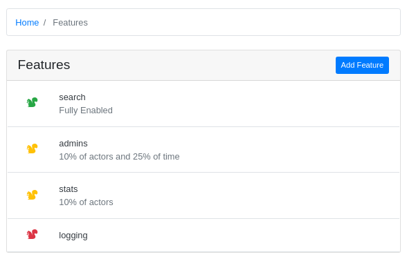
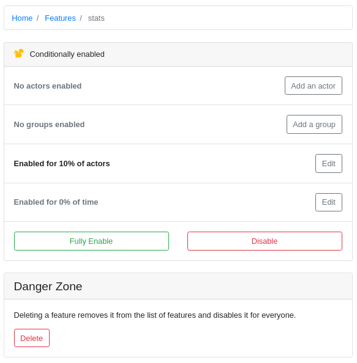

# Flipper::UI

UI for the [Flipper](https://github.com/jnunemaker/flipper) gem.

## Screenshots

Viewing list of features:


Viewing an individual feature:


## Installation

Add this line to your application's Gemfile:

    gem 'flipper-ui'

And then execute:

    $ bundle

Or install it yourself as:

    $ gem install flipper-ui

## Usage

### Rails

Given that you've already initialized `Flipper` as per the [flipper](https://github.com/jnunemaker/flipper) readme, you can mount `Flipper::UI` to a route of your choice:

```ruby
# config/routes.rb
YourRailsApp::Application.routes.draw do
  mount Flipper::UI.app(flipper) => '/flipper'
end
```

If you'd like to lazy load flipper, you can pass a block instead:

```ruby
# config/routes.rb
YourRailsApp::Application.routes.draw do
  flipper_block = lambda {
    # some flipper initialization here, for example:
    # YourRailsApp.flipper
  }
  mount Flipper::UI.app(flipper_block) => '/flipper'
end
```

#### Security

You almost certainly want to limit access when using Flipper::UI in production. 

##### Basic Authentication via Rack
The `Flipper::UI.app` method yields a builder instance prior to any predefined middleware. You can insert the `Rack::Auth::Basic` middleware, that'll prompt for a username and password when visiting the defined (i.e., `/flipper`) route.

```ruby
# config/routes.rb

flipper_app = Flipper::UI.app(Flipper.instance) do |builder|
  builder.use Rack::Auth::Basic do |username, password|
    # Verify credentials
  end
end
mount flipper_app, at: '/flipper'
```

##### Route Constraints
It is possible to use [routes constraints](http://guides.rubyonrails.org/routing.html#request-based-constraints) to limit access to routes:

```ruby
# config/routes.rb

flipper_constraint = lambda { |request| request.remote_ip == '127.0.0.1' }
constraints flipper_constraint do
  mount Flipper::UI.app(flipper) => '/flipper'
end
```

Another example is to use the `current_user` when using a gem-based authentication system (i.e., [warden](https://github.com/hassox/warden) or [devise](https://github.com/plataformatec/devise)):

```ruby
# initializers/admin_access.rb

class CanAccessFlipperUI
  def self.matches?(request)
    current_user = request.env['warden'].user
    current_user.present? && current_user.respond_to?(:admin?) && current_user.admin?
  end
end

# config/routes.rb

constraints CanAccessFlipperUI do
  mount Flipper::UI.app(flipper) => '/flipper'
end
```

### Standalone

Minimal example for Rack:

```ruby
# config.ru

require 'flipper-ui'
require 'flipper/adapters/memory'

adapter = Flipper::Adapters::Memory.new
flipper = Flipper.new(adapter)

run Flipper::UI.app(flipper) { |builder|
  builder.use Rack::Session::Cookie, secret: "something long and random"
}
```

The key is that you need to have sessions setup. Rails does this for you, so this step isn't necessary, but for standalone rack, you'll need it. Without sessions setup, you will receive a Runtime error like:

```
RuntimeError: you need to set up a session middleware *before* Rack::Protection::RemoteToken.
```

See [examples/ui/basic.ru](https://github.com/jnunemaker/flipper/blob/master/examples/ui/basic.ru) for a more full example

## Contributing

1. Fork it
2. Create your feature branch (`git checkout -b my-new-feature`)
3. **Fire up the app** (`script/server`)
4. **Start up guard** (`bundle exec guard` for automatic coffeescript/sass compilation and such).
5. Commit your changes (`git commit -am 'Added some feature'`)
6. Push to the branch (`git push origin my-new-feature`)
7. Create new Pull Request
